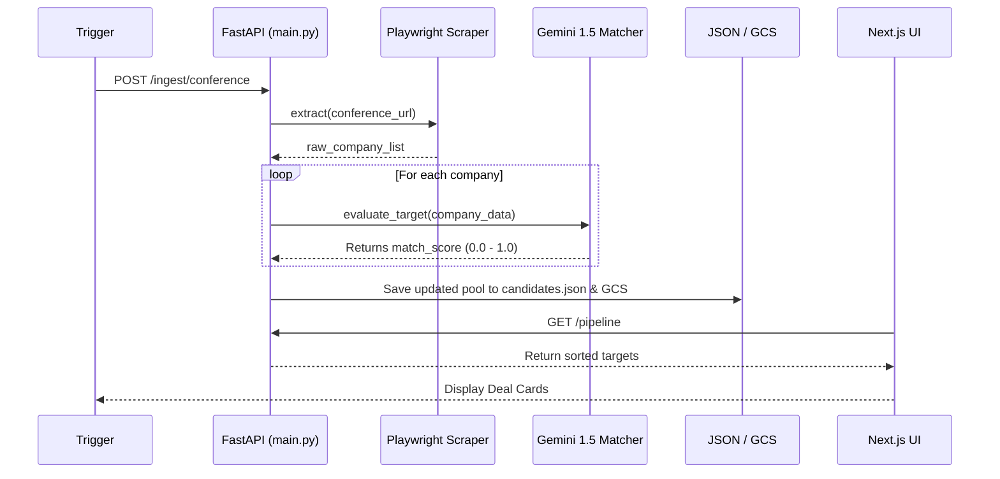

# The Flow: Averroes Deal Origination Architecture

This document walks you through the step-by-step technical journey of how a company target goes from being an unknown name on a conference website to a scored, qualified card on your executive dashboard.

---

## High-Level Sequence Diagram



---

## Step 1: The Trigger mechanism
The ingestion cycle begins when the backend API receives a request to scrape a specific conference.

**File Location:** `backend/main.py`
```python
@app.post("/ingest/conference")
async def ingest_conference(conference_name: str):
    """
    1. Triggers the scraper.
    2. Runs the AI filter.
    3. Saves data.
    """
    # 1. Trigger the scraper module
    companies = scraper.scrape_conference(conference_name)
    
    # 2. Setup AI Evaluation
    philosophy = AverroesPhilosophy()
    refined_companies = []
    
    # ... evaluation loop ...
```

---

## Step 2: Sourcing (Data Extraction)
The system uses the Playwright library to physically open a headless browser, navigate to a conference page (like SaaStock or London Tech Week), and extract company names, sectors, and descriptions from the HTML.

**File Location:** `backend/scrapers/conference_scraper.py`
```python
class ConferenceScraper:
    def scrape_conference(self, conference_name: str):
        # Example logic: navigating and extracting HTML
        # In a generic setup, this uses Playwright to mimic human navigation:
        # browser = playwright.chromium.launch(headless=True)
        # page = browser.new_page()
        # page.goto(target_url)
        # raw_elements = page.locator('.exhibitor-card').all_text_contents()
        
        # It returns structured dicts:
        return [
           {"name": "DuploCloud", "sector": "DevOps", "description": "Cloud compliance..."}
        ]
```

---

## Step 3: AI Matching & Filtering (The "Brain")
Once the scraper has raw data, we must determine if the company actually fits Averroes Capital's strict B2B SaaS criteria. We pass the data to an LLM (Gemini) primed with your specific investment philosophy.

**File Location:** `backend/ai/criteria.py`
```python
class AverroesPhilosophy:
    def __init__(self):
        self.focus = "B2B SaaS"
        self.region = "UK/Europe"
        self.ebitda_floor = 2_000_000
        self.preferred_growth = "Rule of 40"

def evaluate_target(company_data: dict, criteria: AverroesPhilosophy) -> float:
    """
    Sends the company data to an LLM to grade against Averroes criteria.
    Returns a float from 0.0 to 1.0.
    """
    # ... Google Gemini Prompting ...
    # Prompt: "Does {company_data['description']} look like a B2B SaaS startup? Rate 0 to 1."
    
    # Example logic processing the LLM's returned score:
    match_score = llm_response.extract_float() 
    return match_score
```

---

## Step 4: Storage & Persistence
After the AI scores the companies, the backend updates the active "database" (currently `candidates.json`) so the dashboard has access to it. It also backs up the raw data directly into Google Cloud Storage for auditing.

**File Location:** `backend/main.py` & `backend/storage/gcs_handler.py`
```python
    # Inside the ingest_conference method:
    for c in companies:
        c["match_score"] = evaluate_target(c, philosophy)
        c["status"] = "Qualified"
        
    # Write to local JSON database (Bridging to Dashboard)
    with open("backend/data/candidates.json", 'w') as f:
        json.dump(refined_companies, f)
        
    # Backup payload to Google Cloud Storage Data Lake
    gcs_handler.save_companies(refined_companies, conference_name)
```

---

## Step 5: Dashboard Visualization (The Frontend)
With the database updated, the Next.js frontend pulls the data. Every time you open or refresh the dashboard, it makes an API call to the backend to get the latest pipeline, enforcing strict TypeScript types in the process.

**File Location:** `frontend/src/services/api.ts`
```typescript
export const dealApi = {
  async getPipeline(): Promise<CompanyTarget[]> {
    // Hits the backend /pipeline endpoint
    const response = await fetch(`${API_BASE_URL}/pipeline`);
    return await response.json();
  }
}
```

The UI then maps over these results, sorting them into the correct columns (`Qualified`, `Under Review`, `Engaged`) and highlighting the Deal Cards based on their AI score:

**File Location:** `frontend/src/app/page.tsx`
```tsx
    const filtered = pipeline.filter(c => c.status === status);
    
    {filtered.map((company, i) => (
      <div key={i} className="card glass">
        <div className="card-header">
           <span className="badge-growth">
             {Math.round(company.match_score * 100)}% Match
           </span>
           <h4>{company.name}</h4>
        </div>
        <p>{company.sector} | {company.source}</p>
        <p className="description">{company.description}</p>
      </div>
    ))}
```

---

## The Complete Loop
This continuous loop ensures your pipeline is perpetually fresh. 
1. The **Scraper** fetches the noise.
2. The **AI** extracts the signal.
3. The **Backend** stores the truth.
4. The **Dashboard** visualizes the opportunity. 
